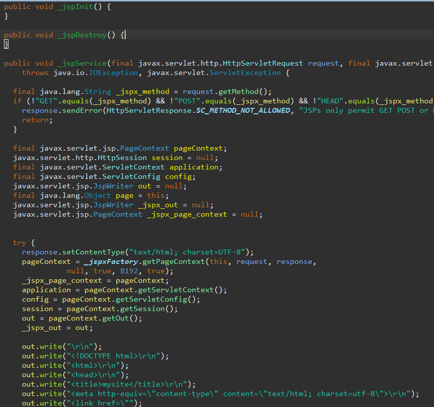
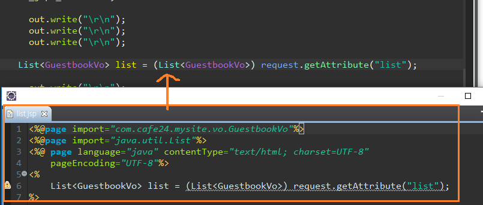

[TOC]

---

[http응답 302, 301 차이](<http://www.japong.com/tutorials/seo/301_redirect.html>)

**redirect** 

301 - 영원히 옮겨짐 : 검색엔진(구글봇 크롤러)에게 옮겨진 url 알려줄때나.. 브라우저 주소창이 변함

**forward**

D:\dowork\Eclipse-Workspace\.metadata\.plugins\org.eclipse.wst.server.core\tmp0\work\Catalina\localhost\mysite1\org\apache\jsp\WEB_002dINF\views

톰캣이 jsp 파싱해서 java파일로 만들어서 컴파일함

> 
>
> 

JSP내의 자바코드도

jsp경로를 class경로로 자동으로 매핑해주는 것

## [Servlet 추측]

web.xml을 읽어서 url매핑이 HashMap 테이블에 등록

| contextPath | url                | 서블릿                                                       |
| ----------- | ------------------ | ------------------------------------------------------------ |
| /mysite1    | /guestbook         | GuestBookServlet                                             |
| /mysite1    | /WEB-INF/index.jsp | D:\dowork\Eclipse-Workspace\.metadata\.plugins \org.eclipse.wst.server.core\tmp0\work\Catalina \localhost\mysite1\org\apache\jsp\WEB_002dINF \views\main\index_jsp.class |

이런식으로 매핑되어 있겠지? 이게 톰캣 메모리 안에 들어있는거야

요청이 오면 위에 테이블을 보고 없으면 404 알아서 내보내주겠지?

filter도 이런식으로 될듯

listsener 는 sessionn등 주변에서 일어나는 이벤트들을 담을수있음

1. 요청이 들어옴
2. 서블릿찾음(테이블에서)
3. 찾은 서블릿 클래스 로딩(new로 객체 만드는 것)
4. 서블릿이 
   1. init() 실행
   2. service() 실행  -> 두번째 요청부턴 여기부터 실행
   3. doGet(), doPost() 실행

---

DefaultServlet -> static service  

(동적인거 톰캣으로 처리 가능) -> 톰캣ㅇㅔ서 처리 가능한데 왜 굳이 아파치를?

아파치를 두는 이유 : 노드관리(로드밸런싱), 보안 등 .. 

---

