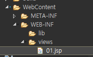
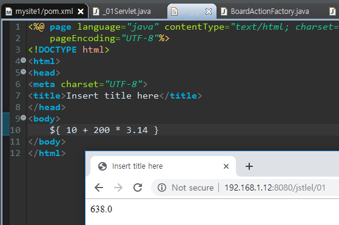
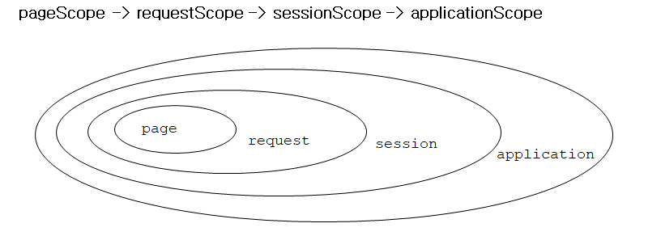
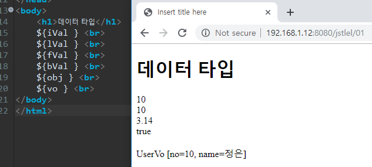
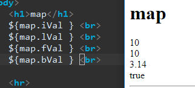
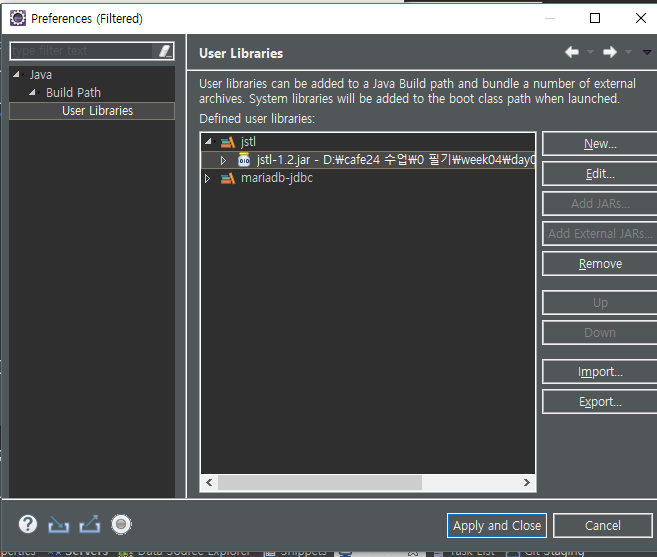
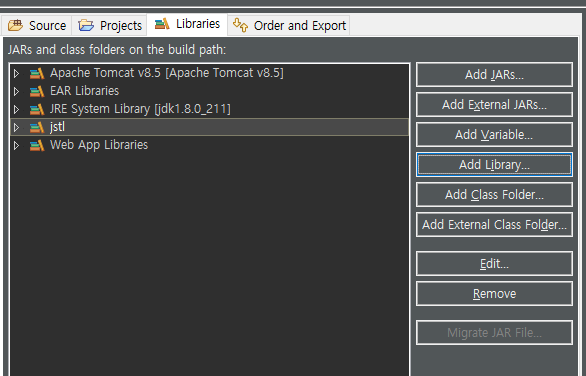
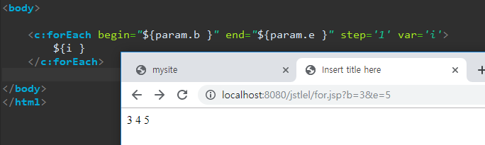
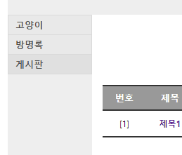
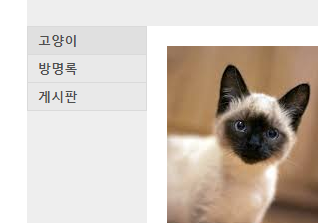

[TOC]

---

# JSP 영역(Scope)

- **page** 영역: 하나의 JSP페이지를 처리할때 사용되는 영역 

- **request** 영역 : 하나의 HTTP요청을 처리할때 사용되는 영역 - request(요청이 처리되는 동안)

- **session** 영역 : 하나의 웹 브라우저와 관련된 영역

- **application** 영역: 하나의 웹 어플리케이션과 관련된 영역, 해당 웹 애플리케이션이 start -> stop될때까지

| 영역        | 영역객체    | 속성의 유효범위                                              |
| ----------- | ----------- | ------------------------------------------------------------ |
| page        | pageContext | 해당 페이지가 클라이언트에 서비스를 제공하는 동안에만 유효(서블릿 인스턴스의 _jspServicer()메소드가 실행되는 동안에만 유효) |
| request     | request     | 클라이언트의 요청이 처리되는 동안 유효(포워딩 또는 include를 이용하는 경우 여러개의 페이지에서도 요청정보가 계속 유지되므로 request영역의 속성을 여러페이지에서 공유할수있다.) |
| session     | session     | 세션이 유지되는 동안 유효(하나의 브라우저에 1개의 세션이 생성되므로 같은 웹브라우저내에서 실행되는 페이지들이 속성을 공유할수있다.) |
| application | application | 웹 애플리케이션이 실행되고 있는 동안 유효(웹 컨테이너에서 해당 어플리케이션은 오직 하나만이 실행되므로 4가지 영역중 가장 큰 영역에 해당) |

## 영역객체의 속성 처리 메소드

| 메서드                                  | 리턴타입              | 설명                                                         |
| --------------------------------------- | --------------------- | ------------------------------------------------------------ |
| setAttribute(String name, Object value) | void                  | [해당 정보저장]<br>이름이 name인 속성의 값을 value로 지정한다. |
| getAttribute(String name)               | Object                | [해당 정보 가져오기]<br/>이름이 name인 속성의 값을 구한다. 지정한 이름의 속성이 존재하지 않을 경우 null을 리턴 |
| removeAttribute(String name)            | void                  | [정보 제거하기]<br/>이름이 name인 속성을 삭제한다.           |
| getAttributeNames()                     | java.util.Enumeration | [모든 속성들의 이름을 가져오기]<br/>속성의 이름 목록을 구한다.( pageContext  기본 객체는 이 메서드를 제공하지 않는다.) |

## 쓰임

| 영역        | 영역객체    | 쓰임새                                                       |
| ----------- | ----------- | ------------------------------------------------------------ |
| page        | pageContext | (한번의 요청을 처리하는) 하나의 JSP페이지 내에서 공유될 값을 저장한다. 주로 커스텀 태그에서 새로운 변수를 추가할때 사용 |
| request     | request     | 한번의 요청을 처리하는데 사용되는 모든 JSP페이지에서 공유될 값을 저장. 주로 하나의 요청을 처리하는데 사용되는 JSP페이지사이에서 정보를 전달하기 위해 사용 |
| session     | session     | 한 사용자와 관련된 정보를 JSP 들이 공유하기 위해서 사용,사용자의 로그인 정보와 같은 것들을 저장. |
| application | application | 모든 사용자와 관련해서 공유할 정보를 저장, 임시 디렉터리 경로와 같은 웹 어플리케이션의 설정 정보를 주로 저장. |

---


---

# EL

> jsp와 java코드를 분리하자

## jstlel project

jstlel/_01Servlet.java

```java
package jstlel;

@WebServlet("/01")
public class _01Servlet extends HttpServlet {
	private static final long serialVersionUID = 1L;

	protected void doGet(HttpServletRequest request, HttpServletResponse response) throws ServletException, IOException {
		request.getRequestDispatcher("/WEB-INF/views/01.jsp").forward(request, response);
	}

	protected void doPost(HttpServletRequest request, HttpServletResponse response) throws ServletException, IOException {
		doGet(request, response);
	}
}
```

> 
>
> 


Application > Session > request > page

ServletContext > HttpSession > HttpServletRequest > pageContext 

**오래 살아있는 범위 & 값 찾는 순서**

> 

---


---

값 받아보기

**_01Servlet.java**

```java
protected void doGet(HttpServletRequest request, HttpServletResponse response) throws ServletException, IOException {
    int iVal = 10;
    long lVal = 10;
    float fVal = 3.14f;
    boolean bVal = true;
    Object obj = null;
    UserVo vo = new UserVo();
    vo.setNo(10);
    vo.setName("정은");

    request.setAttribute("iVal", iVal);
    request.setAttribute("lVal", lVal);
    request.setAttribute("fVal", fVal);
    request.setAttribute("bVal", bVal);
    request.setAttribute("obj", obj);
    request.setAttribute("vo", vo);

    request.getRequestDispatcher("/WEB-INF/views/01.jsp").forward(request, response);
}
```

**01.jsp**



---


---

#### 요청 파라미터

<http://localhost:8080/jstlel/01?a=3>

`${param.a }`   == `<%= request.getParameter("a") %>`

> 
>
> el은 자동으로 int로 변환해줌 


#### 객체접근

> 


## el scope test

**_01Servlet.java**

```java
//request scope
UserVo vo = new UserVo();
vo.setNo(10);
vo.setName("정은");
request.setAttribute("vo", vo);


//session scope
UserVo vo2 = new UserVo();
vo2.setNo(20);
vo2.setName("정은2");
HttpSession session = request.getSession(true);
session.setAttribute("vo", vo2);
```

> 

근데 웬만하면 같은이름 넘기지마 Map으로 넘기던가~

**_01Servlet.java**

```java
Map<String,Object> map = new HashMap<String, Object>();
map.put("iVal", iVal);
map.put("lVal", lVal);
map.put("fVal", fVal);
map.put("bVal", bVal);
request.setAttribute("map", map);
```

> 

---


---

# JSTL

## 라이브러리 추가 ! 






add!

---

### foreach 




---

**color.jsp**


`<%@ taglib prefix="c" uri="http://java.sun.com/jsp/jstl/core"%>` 

라이브러리 추가!

```jsp
<body>
	<c:choose>
		<c:when test="${param.c == 'red' }">
			<h1 style='color:#f00;'> Hello World</h1>
		</c:when>
		<c:when test="${param.c == 'green' }">
			<h1 style='color:#0f0;'> Hello World</h1>
		</c:when>
		<c:when test="${param.c == 'blue' }">
			<h1 style='color:#00f;'> Hello World</h1>
		</c:when>
		<c:otherwise
                     >
			<h1 style='color:black;'> Hello World</h1>
		</c:otherwise>
	</c:choose>
</body>
```


### 

---

### mysite1에 pom.xml jstl 추가

<https://mvnrepository.com/artifact/jstl/jstl/1.2>

pom.xml

```xml
<!-- jstl -->
<dependency>
    <groupId>jstl</groupId>
    <artifactId>jstl</artifactId>
    <version>1.2</version>
</dependency>
```


---

### mysite/views/*.jsp수정

**includes/header.jsp** 라이브러리 추가

```jsp
<%@ page language="java" contentType="text/html; charset=UTF-8"
    pageEncoding="UTF-8"%>
<%@ taglib uri="http://java.sun.com/jsp/jstl/core" prefix="c"%>
<%@ taglib uri="http://java.sun.com/jsp/jstl/fmt" prefix="fmt"%>
<%@ taglib uri="http://java.sun.com/jsp/jstl/functions" prefix="fn"%>  

<div id="header">
    <h1>MySite</h1>
    <ul>
        <c:choose>
            <c:when test='${empty authUser }'>
                <li><a href="${pageContext.servletContext.contextPath}/user?a=loginform">로그인</a><li>
                <li><a href="${pageContext.servletContext.contextPath}/user?a=joinform">회원가입</a></li>
            </c:when>
            <c:otherwise>
                <li><a href="${pageContext.servletContext.contextPath}/user?a=updateform">회원정보수정</a></li>
                <li><a href="${pageContext.servletContext.contextPath}/user?a=logout">로그아웃</a></li>
                <li>${authUser.getName() } 님 안녕하세요 ^^;</li>		
            </c:otherwise>
        </c:choose>
    </ul>
</div>
```

**guestbook/list.jsp**

```jsp
<c:forEach items='${list }' var='vo' varStatus='status'>
    ${status.count }         <!-- status : 몇번 돌았는지 -->
</c:forEach>
```

`<c:set />` : pageContext에 변수 저장

```jsp
<c:set var='count' value='${fn:length(list) }'/>
<c:forEach items='${list }' var='vo' varStatus='status'>
    <ul>				
        <li>
            <table>
                <tr>
                    <td>[${count - status.index }] </td>
                    <td>${vo.name }</td>
                    <td>${vo.regDate}</td>
                    <td><a href="${pageContext.servletContext.contextPath}/guestbook?a=deleteform&no=${vo.no }">삭제</a></td>
                </tr>
                <tr>
                    <td colspan=4>${vo.contents} </td>
                </tr>
            </table> <br>
        </li>
    </ul>
</c:forEach>
```

${vo.contents} 개행 표현

```jsp
<%
	pageContext.setAttribute("newline", "\n");
%>  
<td colspan=4>${fn:replace(vo.contents, newline ,"<br>")} </td>
```

#### import

```jsp
<%@ taglib uri="http://java.sun.com/jsp/jstl/core" prefix="c"%>
<%@ taglib uri="http://java.sun.com/jsp/jstl/fmt" prefix="fmt"%>
<%@ taglib uri="http://java.sun.com/jsp/jstl/functions" prefix="fn"%>  
<c:import url="/WEB-INF/views/includes/header.jsp"> </c:import>
<c:import url="/WEB-INF/views/includes/navigation.jsp"> </c:import>
<c:import url="/WEB-INF/views/includes/footer.jsp"> </c:import>
```

---


### navigation

css 설정

jsp import에서 param값을 줄 수 있음

```jsp
		<c:import url="/WEB-INF/views/includes/navigation.jsp"> 
			<c:param name="menu" value="main" />
		</c:import>
```

**navigation.jsp** 일단 무식하게..

```jsp
<%@ taglib uri="http://java.sun.com/jsp/jstl/core" prefix="c"%>
<%@ taglib uri="http://java.sun.com/jsp/jstl/fmt" prefix="fmt"%>
<%@ taglib uri="http://java.sun.com/jsp/jstl/functions" prefix="fn"%>  
<%@ page language="java" contentType="text/html; charset=UTF-8"
	pageEncoding="UTF-8"%>
<!DOCTYPE html>
<div id="navigation">
	<ul>
		<c:choose>
			<c:when test='${param.menu == "main" }'>
				<li class="selected"><a href="${pageContext.servletContext.contextPath}">고양이</a></li>
				<li><a href="${pageContext.servletContext.contextPath}/guestbook">방명록</a></li>
				<li><a href="${pageContext.servletContext.contextPath}/board">게시판</a></li>
			</c:when>
			<c:when test='${param.menu == "guestbook" }'>
				<li><a href="${pageContext.servletContext.contextPath}">고양이</a></li>
				<li class="selected"><a href="${pageContext.servletContext.contextPath}/guestbook">방명록</a></li>
				<li><a href="${pageContext.servletContext.contextPath}/board">게시판</a></li>
			</c:when>
			<c:when test='${param.menu == "board" }'>
				<li><a href="${pageContext.servletContext.contextPath}">고양이</a></li>
				<li><a href="${pageContext.servletContext.contextPath}/guestbook">방명록</a></li>
				<li class="selected"><a href="${pageContext.servletContext.contextPath}/board">게시판</a></li>
			</c:when>
			<c:otherwise>
				<li><a href="${pageContext.servletContext.contextPath}">고양이</a></li>
				<li><a href="${pageContext.servletContext.contextPath}/guestbook">방명록</a></li>
				<li><a href="${pageContext.servletContext.contextPath}/board">게시판</a></li>
			</c:otherwise>
		</c:choose>
	</ul>
</div> 
```





---

