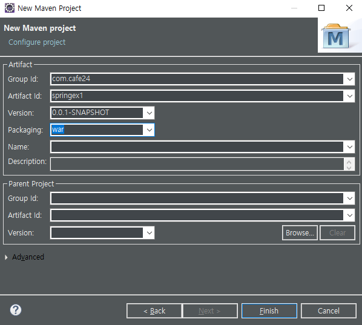
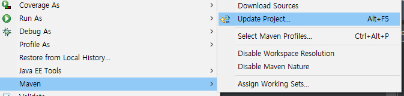
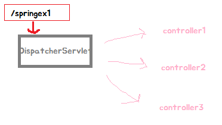
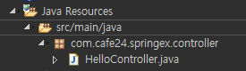
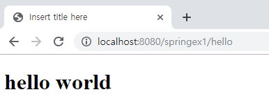

[TOC]


---

## new project

springex01 - xml 버전

> 


### pom.xml

```xml
<project xmlns="http://maven.apache.org/POM/4.0.0"
	xmlns:xsi="http://www.w3.org/2001/XMLSchema-instance"
	xsi:schemaLocation="http://maven.apache.org/POM/4.0.0 http://maven.apache.org/xsd/maven-4.0.0.xsd">
	<modelVersion>4.0.0</modelVersion>
	<groupId>com.cafe24</groupId>
	<artifactId>springex1</artifactId>
	<version>0.0.1-SNAPSHOT</version>
	<packaging>war</packaging>
	<properties>
		<project.build.sourceEncoding>UTF-8</project.build.sourceEncoding>
		<project.reporting.outputEncoding>UTF-8</project.reporting.outputEncoding>
	</properties>

	<dependencies> 
		<!-- jstl -->
		<dependency>
			<groupId>jstl</groupId>
			<artifactId>jstl</artifactId>
			<version>1.2</version>
		</dependency>

	</dependencies>

	<build>
		<sourceDirectory>src/main/java</sourceDirectory>

		<plugins>
			<plugin>
				<artifactId>maven-compiler-plugin</artifactId>
				<version>3.8.0</version>
				<configuration>
					<source>1.8</source>
					<target>1.8</target>
				</configuration>
			</plugin>

			<plugin>
				<groupId>org.apache.maven.plugins</groupId>
				<artifactId>maven-war-plugin</artifactId>
				<version>3.2.1</version>
				<configuration>
					<warSourceDirectory>src/main/webapp</warSourceDirectory>
				</configuration>
			</plugin>
		</plugins>
	</build>
</project> 
```

**Maven - update project**

> 

**web.xml**


> **3.0version으로 바꾸기**

---

**springframework라이브러리 추가**

**pom.xml**

```xml
<properties>
     <org.springframework-version>4.3.1.RELEASE</org.springframework-version>
</properties>
```

```xml
<!-- Spring Core -->
<dependency>
    <groupId>org.springframework</groupId>
    <artifactId>spring-context</artifactId>
    <version>${org.springframework-version}</version>
</dependency>

<!-- Spring Web -->
<dependency>
    <groupId>org.springframework</groupId>
    <artifactId>spring-web</artifactId>
    <version>${org.springframework-version}</version>
</dependency>

<!-- Spring Web MVC -->
<dependency>
    <groupId>org.springframework</groupId>
    <artifactId>spring-webmvc</artifactId>
    <version>${org.springframework-version}</version>
</dependency>
```

**web.xml**  DispatcherServlet 등록

```xml
<!-- Dispatcher Server(Front Controller)-->
<servlet>
	<servlet-name>spring</servlet-name>
	<servlet-class>org.springframework.web.servlet.DispatcherServlet</servlet-class>
</servlet>
  
<servlet-mapping>
	<servlet-name>spring</servlet-name>
	<url-pattern>/</url-pattern>
</servlet-mapping>

```

Dispatcher Server -> Front Controller

톰캣이 /springex1로 오면 여기로 안내해주고

그다음 경로부터는 DispatcherServlet이 각각의 컨트롤러로 분리시켜줌

> 


---


### spring-servlet.xml


```xml
<?xml version="1.0" encoding="UTF-8"?>
<beans
	xmlns:xsi="http://www.w3.org/2001/XMLSchema-instance"
	xmlns:aop="http://www.springframework.org/schema/aop" 
	xmlns="http://www.springframework.org/schema/beans"
	xmlns:p="http://www.springframework.org/schema/p" 
	xmlns:context="http://www.springframework.org/schema/context"
	xmlns:mvc="http://www.springframework.org/schema/mvc"
	xsi:schemaLocation="http://www.springframework.org/schema/mvc http://www.springframework.org/schema/mvc/spring-mvc.xsd
	http://www.springframework.org/schema/aop http://www.springframework.org/schema/aop/spring-aop.xsd
	http://www.springframework.org/schema/beans http://www.springframework.org/schema/beans/spring-beans.xsd
	http://www.springframework.org/schema/context http://www.springframework.org/schema/context/spring-context.xsd">

	<context:annotation-config />
	<context:component-scan base-package="com.cafe24.springex.controller" />

</beans>

```

### Controller

**HelloController.java**



```java
package com.cafe24.springex.controller;

@Controller
public class HelloController {
    
    @RequestMapping("/hello")
	public String hello() {
		return "/WEB-INF/views/hello.jsp";
	}
}
```

###  target runtime등록


### jsp


```jsp
<h1>hello world</h1>
```

### 서버 띄우기




---


---

## **스프링 순서**


---

### 1. init()

첫번째 Dispatcher Servlet에 요청이 들어오면 컨테이너 만

init { 

`ApplicationContext = new WebXmlApplicationContext('spring-servlet.xml ');`

하면 컨테이너를 만들어서 그 컨테이너가 spring-servlet.xml 파일을 스캐닝

-> 원래는 

spring-servlet.xml에서 `<bean> </bean>` 으로 클래스 지정했는데, @어노테이션으로함

Web과 관련된 bean이 있으니까

Web Application Context라고 함! 

}

1. 컨테이너 만듦
2. 스캐닝을 통해 메소드를 추출해 HandlerMapping 만듦
3. MVC객체 생성

#### HandlerMapping

| url    | controller객체           | Method 이름 | parameter    |
| ------ | ------------------------ | ----------- | ------------ |
| /hello | HelloController를 가리킴 | hello       | 파라미터정보 |


#### ViewResolver

view이름을 주면 html을 만들수있는 view를 return


### 2. Service


### 3. doGet()

url = "/hello";

String viewName = HelloController.hello() 메소드 실행 

`viewName = "/WEB-INF/views/hello.jsp"`

뷰리절브한테 JSP v = vr.resolve(viewName) 이런식으로 JSP를 받아옴

그럼 v.render() 하면  render안에서 forwarding되면서 끝남


