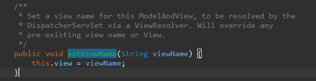
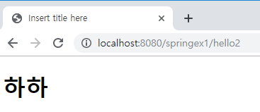
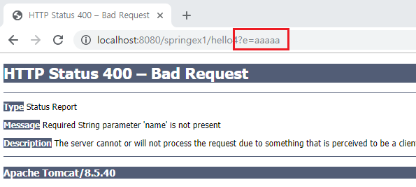
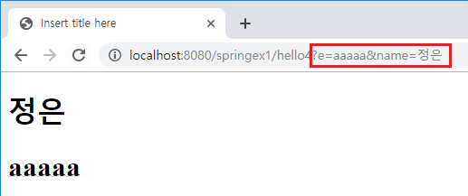

[TOC]

---

# ModelAndView

## 1번째 방법

controller return 

**string** - view name으로 인식(view resolver -> render)

**mav** 

- ModelAndView객체에는 String(view name)과 key,value가 매핑되어있음

- **ModelAndView.java**

  ```java
  String viewName
  Model model    // Model객체는 map으로 
  ```

  

  

  

- 여기서 viewName가지고 랜더링하는듯


**HelloController.java**

```java
	@RequestMapping("/hello2")
	public ModelAndView hello2() {
		ModelAndView mav = new ModelAndView();
		mav.addObject("haha", "하하"); 
		mav.setViewName("/WEB-INF/views/hello2.jsp");
		return mav;
	}
```

**hello2.jsp**

```jsp
<h1>${haha }</h1>
```

> 


## 2번째 방법

doGet()에서 `new Model`을 미리 만들어서 controller에 hello3를 보낼때 model을 넣어주는것 그리고 나서 return할때는

vr.resolver(viewName, Model) 이렇게 

**HelloController.java**

```java
	@RequestMapping("/hello3")
	public String hello3(Model model) {
		model.addAttribute("name","이정은");
		
		return "/WEB-INF/views/hello3.jsp";
	}
```

> 

---


### parameter 받기 @RequestParam

`@RequestParam("a") String b`

a라는 이름의 파라미터를 받아 b변수로 사용

**HelloController.java**

```java
@RequestMapping("/hello4")
public String hello4(Model model, @RequestParam(value="e") String email) {
    model.addAttribute("email", email);
    return "/WEB-INF/views/hello3.jsp";
}
```

? 

```java
@RequestMapping("/hello4")
public String hello4(Model model, @RequestParam(value="e") String email, @RequestParam String name /*어노테이션에 value 생략시 변수이름으로 request parameter name을 대체*/) {
    model.addAttribute("email", email);
    model.addAttribute("name", name);
    return "/WEB-INF/views/hello3.jsp";
}
```

> name없으면 error남
>
> 
>
> 

원래 어노테이션도

`@RequestMapping(value="/hello4", method=RequestMethod.POST)` 이렇게 설정가능

---


---

### HttpServletRequest는 사용하지 말자

Sevlet기술이 침투했기 때문에 비추! -> 개념 없는거임

**HelloController.java**

```java
	@RequestMapping("/hello5")
	public String hello5(Model model, HttpServletRequest request) {
		String name = request.getParameter("name");
		String email = request.getParameter("email");
		
		model.addAttribute("email", email);
		model.addAttribute("name", name);
		
		return "/WEB-INF/views/hello3.jsp";
	}
```

> 

