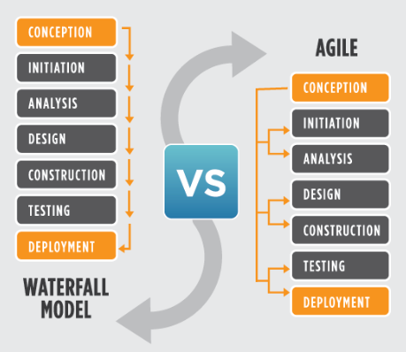
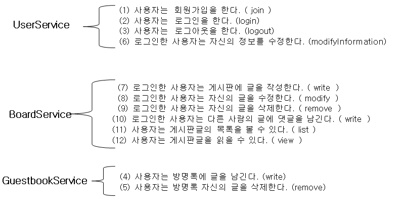
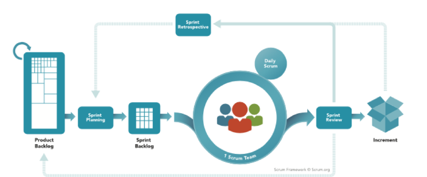

[TOC]


# Enterprise Application Architecture

​																						 	**Repository**


로직이 복잡할수록 Service가 중요함

- service에서 여러 Dao를 불러올 수 있음 service가 트랜잭션 단위가 됨

---


---

# User Story

agile < --- > waterfall




Waterfall은 다음단계를 이미 진행하면 이전단계로 못돌아가. 별로임 


---

### 비즈니스 분석 ( 사용자  스토리 도출 )

```
 (1) 사용자는  회원가입을 한다.
​ (2) 사용자는  로그인을 한다.
​ (3) 사용자는  로그아웃을 한다.

​ (4) 사용자는 방명록에 글을 남긴다.
​ (5) 사용자는 방명록 자신의 글을 삭제한다.

​ (6) 로그인한 사용자는 자신의 정보를 수정한다.
​ (7) 로그인한 사용자는 게시판에 글을 작성한다.
​ (8) 로그인한 사용자는 자신의 글을 수정한다.
​ (9) 로그인한 사용자는 자신의 글을 삭제한다.
​ (10) 로그인한 사용자는 다른 사람의 글에 댓글을 남긴다.
​ (11) 사용자는 게시판글의 목록을 볼 수 있다.
​ (12) 사용자는 게시판글을 읽을 수 있다.  
```

### TODO

TODO : 

> 위의 기능 12개의 카드를 만들어서 한명씩 카드를 돌려서 가중치 점수를 계산함
>
> (얼마나 걸릴지에대한 점수) 모두가 비슷한 점수가 나올 때 까지 계속 돌려서 가중치를 결정함 : 전체 합을 계산하고 그 점수가 0점이 되면 프로젝트 완성!
>
> 그 후 1~2주동안 개발을 해봄

Doing 		

> 한 20점 정도만 일단 해보자
>
> (1)(2)(3) 기능만 일단 해보자!
>
> 1~2주동안 그 팀이 몇점을 소요하는지 체크

Done

> 해결한 기능들 리스트
>
> (1)(2)는 끝냈는데 (3)을 못끝냄,
>
> 그 다음주는 15점만해보자~ 해서 완만하게 해나가는것을 계산해서 얼마정도 걸릴지 예측


### 서비스 정의

> 


## agile


### Scrum Programming

> 


### Extreme Programming

> 
>
> > pair programmin : 한사람은 코딩하고 한사람은 잔소리 
> >
> > TDD 
> >
> > Refactoring
> >
> > CI(Continuous Integration) : 항상 실행이 되야함 (오늘까지 완성된걸 확인) 프로그램 에러있으면 올리지마!!!!!! **issue tracker** --> **Jenkins** 가 패치, 빌드 auto해줌

