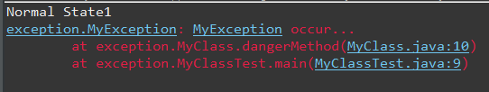
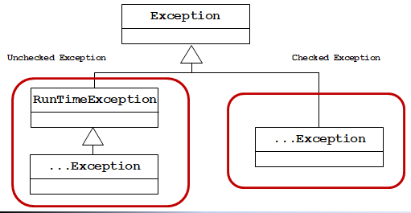
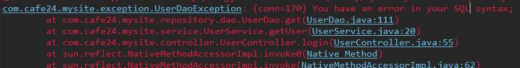
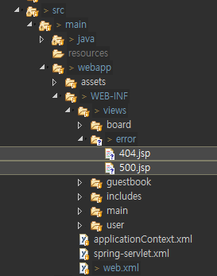
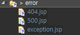
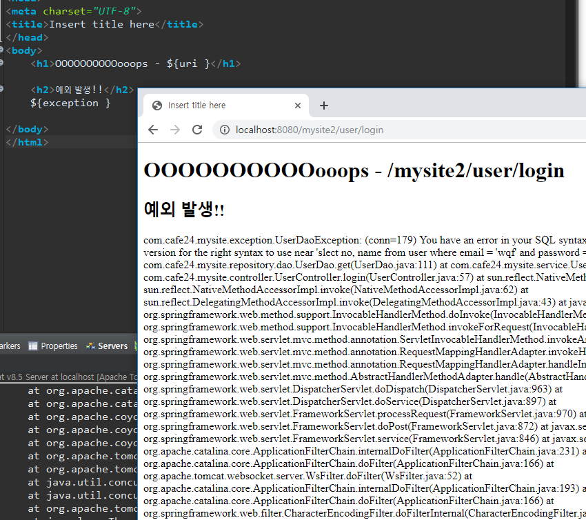

[TOC]


---

# Exception

java-oop project

### Checked Exception
: 컴파일할 때 확인 되는 예외로 예외처리가 필요함

package : **exception/ExceptionTest.java**

```java
			int a = 0;
			System.out.println("Somde Codes..");
			
			int k = 10000000 / a;
			System.out.println("More Codes......");
			System.out.println("More Codes......");
```

위의 코드 같은건 에러잖아,

> 

**TRY CATCH!!!!!!**

```java
package exception;
public class ExceptionTest {

    public static void main(String[] args) {
        try {
            int a = 0;
            System.out.println("Somde Codes..");

            int k = 10000000 / a;
            System.out.println("More Codes......");
            System.out.println("More Codes......");
        } catch (ArithmeticException e) {
            // 1. 로그 남기기 
            System.out.println("error : " + e);
            // 2. 사과
            System.out.println("죄송합니다..");
            // 3. 정상 종료
            return;
            // 4. 1~3이 안되면
            // e.printStackTrace();
		} finally {
			System.out.println("자원정리");
		}
	}
}
```

---


---

**ArrayException.java**

```java
		int [] a = {10, 20, 30, 40, 50};
		
		for(int i=0; i<=5; i++) {
			System.out.println(a[i]);
		}
```

> 이런건 코드가 잘못된거잖아 코드 고쳐~

---


---

### Unchecked Exception
: 실행시점에 확인되는 예외로 예외처리를 하지 않아도 컴파일 됨

**MyClass.java**

```java
package exception;

public class MyClass {

	public void dangerMethod() {
		System.out.println("Normal State1");		
		boolean isDanger = true;
		if(isDanger) {
			// 예외상황 발생
			throw new MyException();
		}
		System.out.println("Normal State2");
	}
}
```

**MyException.java 만들기**

```java
package exception;
public class MyException extends Exception {

	private static final long serialVersionUID = 1L;

	public MyException() {
		super("MyException occur...");
	}
	
	public MyException(String message) {
		super(message);
	}

}
```

**MyClassTest.java**

```java
package exception;
public class MyClassTest {
	public static void main(String[] args) {
		try {
			MyClass myClass = new MyClass();
			myClass.dangerMethod();
		} catch (MyException e) {
			e.printStackTrace();
		}
    }
}
```

> 


---


# Spring Exception



**Exception을 다 모아서 Controller에서 한번에 처리!**

Controller들이 try/catch문을 하나씩 가져

나중에 AOP를 통해 이것까지 하나로 모아! 

try/catch문을 다 빼서 하나의 모듈로 만듦

service는 sqlexception을 받아선 안돼, 비즈니스를 처리하는 곳이잖아 

[AOP에 관해....](<https://yookeun.github.io/java/2014/10/01/spring-aop/>)

---

## 코드 고쳐보기

com.cafe24.mysite.exception 패키지 만들기

**UserDaoException.java**

```java
package com.cafe24.mysite.exception;

public class UserDaoException extends RuntimeException {
	private static final long serialVersionUID = 1L;
	
	public UserDaoException() {
		super("UserDaoException Occurs");
	}
	
	public UserDaoException(String message) {
		super(message);
	}
}
```


**UserDao.java**

```java
public UserVo get(UserVo userVo) throws UserDaoException{		
    
    ...
    
} catch (SQLException e) {
    throw new UserDaoException(e.getMessage());
```

> 

Dao에서 일어난 SQLException이 RuntimeException으로 포장이 되어서 Service로 올라감, -> 나중에 MyBatis가 이 전환작업을 해줌! 


---


## Exception Handler

- Tomcat Error Page 수정

**web.xml**

```xml
	<!-- 공통 에러 페이지  -->
	<error-page>
		<error-code>404</error-code>
		<location>/WEB-INF/views/error/404.jsp</location>
	</error-page>
	<error-page>
		<error-code>500</error-code>
		<location>/WEB-INF/views/error/500.jsp</location>
	</error-page>
```

**jsp 파일 만들기**

> 

> 


---


## Controller 에서 예외처리

**UserController.java** 메소드 추가

```java
	@ExceptionHandler( Exception.class )
	public String handleUserDaoException() {
		return "error/exception";
	}
```

> 
>
> ```html
> 	<h1>OOOOOOOOOOooops~~~~~~~~~~~~!</h1>
> 
> 	<h2>예외 발생!!</h2>
> ```
>
>  

---


---

## 어드바이징 컨트롤러에서의 예외 처리 

### `@ExceptionHandler`

###   **@ControllerAdvice** - 전역 처리 Global Level using 

**GlobalExceptionHandler.java**

> mysite2는 앞으로 예외처리가 발생하면 다 여기로 들어옴!
>
> error -> log file로 저장해야함
>
> 에러 메세지를 String으로 만들어야함
>
> printwriter로 String Writer에 buffer에 저장하고 string writer.tostring() 하면 됨

```java
package com.cafe24.mysite.exception;
@ControllerAdvice
public class GlobalExceptionHandler {
	
	@ExceptionHandler( Exception.class )
	public void handlerException( HttpServletRequest request, 
									HttpServletResponse response,
									Exception e) throws Exception {
		// 1. 로깅
		e.printStackTrace();
		StringWriter errors = new StringWriter(); // 버퍼 
		e.printStackTrace(new PrintWriter(errors));
		// LOGGER.error(errors.toString());
		System.out.println(errors.toString());
		
		// 2. 안내 페이지 가기 + 정상종료(response)
		request.setAttribute("uri", request.getRequestURI());
		request.setAttribute("exception", errors.toString());
        
		request.getRequestDispatcher("/WEB-INF/views/error/exception.jsp").forward(request, response);
	}
}
```

> LOGGER는 파일로도 남길수있고, 콘솔에 메세지도 띄울수있음 나중에 배움


**spring-servlet.xml** 관리 패키지 추가

```xml
	<!-- Controller Scanning하는 base package 지정 -->
	<context:component-scan
		base-package="com.cafe24.mysite.controller, com.cafe24.mysite.exception" />
```

> 

```jsp
<pre>${exception }</pre>
```

> 


