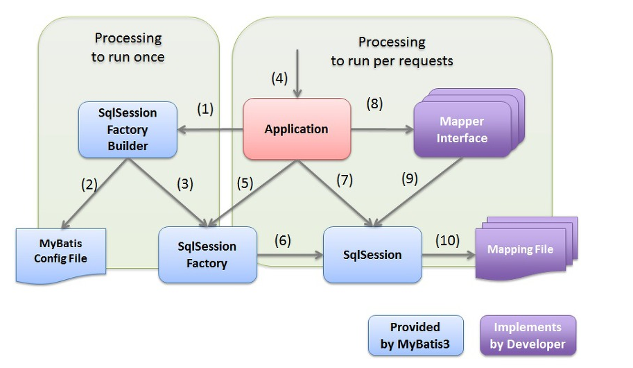
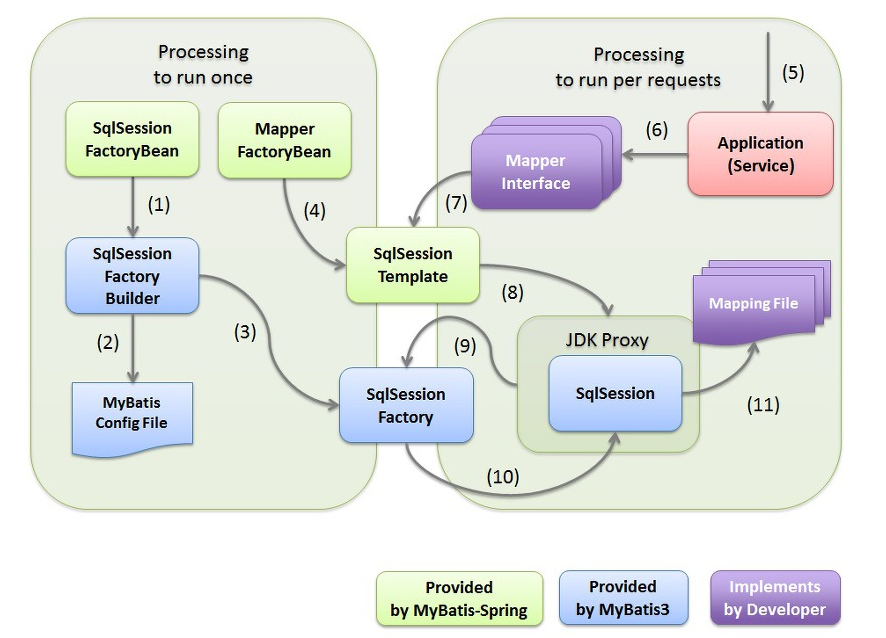
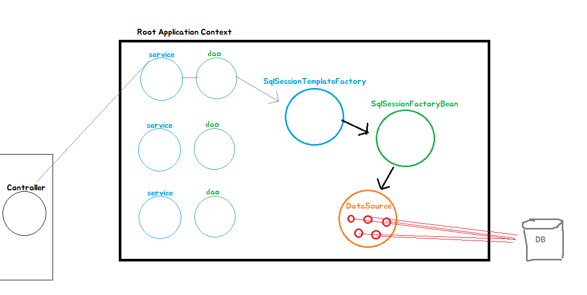
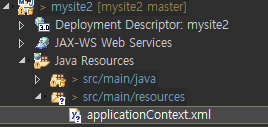
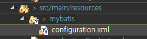
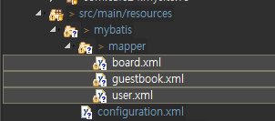
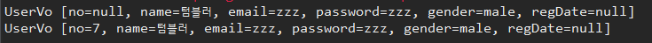

[TOC]


---

# Spring MyBatis

- JDBC를 통해 DB를 사용하려면, Connection 타입의 DB 연결 객체가 필요하다.

- 엔터프라이즈 환경에서는 각 요청마다 Connection을 새롭게 만들고 종료시킨다.

- 애플리케이션과  DB사이의 실제 커넥션을 매번 새롭게 만드는 것은 비효율적이고 성능저하 -> **매번 `new`하면 안좋으니까, 미리 커넥션을 만들어놓고 DB와 연결시킴**

- 풀링(pooling) 기법 사용 : 정해진 개수의 DB Connection Pool에 준비하고 애플리케이션 요청때 마다 꺼내서 할당하고 돌려받아  pool에 저장.

  > Connection Pool : 커넥션 객체를 컨테이너에 미리 만들어놓고, 필요할때마다 갖다 쓰고 반납하는 형식이라 생각하면 됨

- Spring에서는 DataSource를 하나의 독립된 빈으로 등록하도록 강력하게 권장.

- 엔터프라이즈 시스템에서는 반드시 DB 연결 풀 기능을 지원하는 DataSource를 사용해야 한다.                                   

**root App context**에 커넥션풀객체를 만들어놓고 Dao에서 주입받아 `cp.getConnection()`으로 사용하면 됨


## MyBatis3 주요 구성 요소가 Database Access하는 순서





[참고사이트]([https://khj93.tistory.com/entry/MyBatis-MyBatis%EB%9E%80-%EA%B0%9C%EB%85%90-%EB%B0%8F-%ED%95%B5%EC%8B%AC-%EC%A0%95%EB%A6%AC](https://khj93.tistory.com/entry/MyBatis-MyBatis란-개념-및-핵심-정리))

---

Root Application Context 컨테이너에 객체 생김

**DataSource**

> Mariadb Connection Pool : pool을 여러개 만들어놓고 하나씩 빌려줌

**SqlSessionFactoryBean** 

> datasource를 참조
>
> SqlSessionFactory에서 Configuration.xml(매핑파일경로정보)를 읽어서 sql문을 갖고있을거임

**SqlSessionTemplateFactory**

> SQL실행, 데이터베이스  엑세스, 매핑파일(xml)에서 쿼리가져와서 실행




---


## 설정

**pom.xml**

```xml
<!-- Common DBCP -->
<dependency>
	<groupId>commons-dbcp</groupId>
	<artifactId>commons-dbcp</artifactId>
	<version>1.4</version>
</dependency>

<!-- spring jdbc -->
<dependency>
	<groupId>org.springframework</groupId>
	<artifactId>spring-jdbc</artifactId>
	<version>${org.springframework-version}</version>
</dependency>

```


**applicationContext.xml 위치 변경**

> 
>
> **web.xml** 위치 변경 알려주기
>
> ```xml
> <context-param>
>     <param-name>contextConfigLocation</param-name>
>     <param-value>classpath:applicationContext.xml</param-value>
> </context-param>
> ```


**applicationContext.xml** 에 bean 설정, 객체 생성! 

> 기본적으로 스프링 객체들은 싱글톤! 하나 커넥션풀로 다 주입받음

```xml
<!-- Connection Pool DataSource -->
<bean id="dataSource" class="org.apache.commons.dbcp.BasicDataSource">
    <property name="driverClassName" value="org.mariadb.jdbc.Driver" />
    <property name="url" value="jdbc:mariadb://192.168.1.52:3307/webdb" />
    <property name="username" value="webdb" />
    <property name="password" value="webdb" />
</bean>
```

`<bean id="dataSource"` 

**Dao에 주입**

```java
	@Autowired
	private DataSource dataSource;
```

`conn = dataSource.getConnection();` 이렇게 바꾸면 됨!

> 만약
>
> `class="org.apache.commons.dbcp.BasicDataSource"` 설정인 Bean이 여러개면
>
> 주입 받을때 `@Autowired` 로 id값 설정하면 됨

---


---

## 템플릿과 API

- 데이터 액세스 기술을 사용하는 코드는 try/catch/finally 와 반복되는 코드로 작성되는 경우가 많다.

- 데이터 액세스 기술은 외부의 리소스와 연동을 통해서 이루어 지기 때문에 다양한 예외 상황이 발생할 경우가 많고 예외상황을 종료하고 리소스를 반환하기 위한 코드가 길고 복잡해 지는 경향이 있다. (가독성이 좋지 않다.)

- 스프링에서는 DI의 응용 패턴인 **템플릿****/****콜백** **패턴**을 이용해 반복되는 판에 박힌 코드를 피하고  예외 변환과 트랜잭션 동기화를 위한 **템플릿**을 제공한다. 

- 해당 기술의 데이터 액세스 기술 API( MyBatis API, JDBC API)와  스프링 데이터 액세스 템플릿을 조합하여 사용한다.   

### MyBatis3.x

- XML을 이용한 SQL과 ORM지원

- ORM : class --> Entity로 매핑
- 매핑 : Parameter Mapping (?에 객체지정) + result mapping
- orm : Parameter + SQL + Result


---

SQLSessionTemplate이 SQLSession을 상속받아(주입받음)

SQLSession  ㅡㅡ> SQLSessionFactory ----> DataSource

​                ↑                                   ↑                                     ↑

SQLSessionTemplate ---> SQLSessionFactoryBean   


---


## MyBatis3.x 설정

### 라이브러리 추가

**pom.xml**

```xml
<!-- MyBatis -->
<dependency>
	<groupId>org.mybatis</groupId>
	<artifactId>mybatis</artifactId>
	<version>3.2.2</version>
</dependency>

<dependency>
	<groupId>org.mybatis</groupId>
	<artifactId>mybatis-spring</artifactId>
	<version>1.2.0</version>
</dependency>

```

---


---

### SessionFactory 설정

**applicationContext.xml**

> **dataSource를 갖고있는 SqlSessionFactoryBean,**
>
> **SqlSessionFactoryBean을 갖고있는 SqlSessionTemplate**

```xml
<!-- MyBatis SqlSessionFactoryBean --> 
<bean id="sqlSessionFactory" class="org.mybatis.spring.SqlSessionFactoryBean"> 
	<property name="dataSource" ref="oracleDatasource" /> 
	<property name="configLocation" value="classpath:mybatis/configuration.xml" /> 
</bean>
```

`"classpath:mybatis/configuration.xml"`

> 

**configuration.xml**

```xml
<?xml version="1.0" encoding="UTF-8" ?>
<!DOCTYPE configuration PUBLIC "-//mybatis.org//DTD Config 3.0//EN" "http://mybatis.org/dtd/mybatis-3-config.dtd">
<configuration>
    <typeAliases>
    </typeAliases>	
    <mappers>
		<mapper resource="mybatis/mapper/user.xml" />
		<mapper resource="mybatis/mapper/guestbook.xml" />
		<mapper resource="mybatis/mapper/board.xml" />
    </mappers>
</configuration>

```

`<mapper resource="mybatis/mapper/***.xml" />`

 : parameter와 result 매핑해주는 파일 설정 해당 경로에 만들기

> 

**user.xml**

```xml
<?xml version="1.0" encoding="UTF-8" ?>
<!DOCTYPE mapper PUBLIC "-//mybatis.org//DTD Mapper 3.0//EN" "http://mybatis.org/dtd/mybatis-3-mapper.dtd">
<mapper namespace="user">
</mapper>

```

**guestbook.xml**

```xml
<mapper namespace="guestbook">
</mapper>
```

**board.xml**

```xml
<mapper namespace="board">
</mapper>
```

---


---

### SqlSessionTemplate 설정

**applicationContext.xml** 추가

```xml
<!-- MyBatis SqlSessionTemplate -->
<bean id="sqlSession"
      class="org.mybatis.spring.SqlSessionTemplate">
    <constructor-arg index="0" ref="sqlSessionFactory" />
</bean>
```

---


---

### Dao 의존관계 주입

```java
	@Autowired 
	private SqlSession sqlSession;
```

> sqlSessionFactory가 mariaDB와 커넥션풀해서 연결하는 그거고
>
> Dao에서 매핑된 객체를 통해 xml에서 쿼리를 가져와서 실질적인 일은
>
> sqlSessionFactory이 의존하는 sqlSession이 하는거임

---


## 코드 수정

### typeAlias

**configuration.xml**

```xml
<configuration>
    <typeAliases>
        <typeAlias alias="uservo" type="com.cafe24.mysite.vo.UserVo"/>
        <typeAlias alias="guestbookvo" type="com.cafe24.mysite.vo.GuestbookVo"/>
        <typeAlias alias="boardvo" type="com.cafe24.mysite.vo.BoardVo"/>
    </typeAliases>
    <mappers>
        <mapper resource="mybatis/mapper/user.xml" />
        <mapper resource="mybatis/mapper/guestbook.xml" />
        <mapper resource="mybatis/mapper/board.xml" />
    </mappers>
</configuration>
```


---

### insert수정

**user.xml** ->user.insert

```xml
<mapper namespace="user">
    <insert id="insert" parameterType="uservo">
        <![CDATA[
  insert into user
  values(null, #{name }, #{email }, #{password }, #{gender }, now())
 ]]>
    </insert>
</mapper>
```

**UserDao.java**

```java
public boolean insert(UserVo vo) {
    int count = sqlSession.insert("user.insert", vo);
    return 1==count;
}
```

---


### Select 수정

**guestbook.xml**

```xml
<mapper namespace="guestbook">
    <select id="getList" resultType="guestbookvo">
	<![CDATA[
		select no, name, contents, date_format(reg_date, '%Y-%m-%d %h:%i:%s')
		from guestbook
		order by reg_date desc
	]]>
    </select>
</mapper>
```

**GuestbookDao.java**

```java
public List<GuestbookVo> getList() {
    List<GuestbookVo> result = sqlSession.selectList("guestbook.getList");
    return result;
}
```

---


---

### parameter여러개 + 쿼리받기 = MAP!!!

**user.xml**

```xml
<select id="getByEmailAndPassword" resultType="uservo" parameterType="map">
    <![CDATA[
  select no, name 
   from user 
  where email = #{email } 
  and password = #{password }
 ]]>
</select>
```

**UserDao.java**

```java
// 로그인
public UserVo get(UserVo userVo) throws UserDaoException{
    /// 파라미터로 email이랑 password왔다 치고 ///
    String email = userVo.getEmail();
    String password = userVo.getPassword();
    //////////////////////////////////////////

    Map<String, String> map = new HashMap<String, String>();
    map.put(email, password);
    UserVo result = sqlSession.selectOne("user.getByEmailAndPassword", map);
    return result;

}
```


---


### selectOne

**user.xml**

```xml
<select id="getByNo" resultType="uservo" parameterType='long'>
    <![CDATA[
  select no, name 
   from user 
  where no = #{no }
 ]]>
</select>
```

> 기본타입은 의미에 맞게 아무이름이나 써도 됨 #{ value }

**UserDao.java**

```java

```

---


---

### update - if문

**user.xml**

```xml
<update id="update" parameterType="uservo">
    <![CDATA[
  update user 
  set name = #{name },
 ]]>
    <if test=" password != '' ">
        <![CDATA[
    password = #{password }
   ]]>
    </if>
    <![CDATA[
   gender = #{gender }
  where no = #{no }

 ]]>
</update>
```

---


---

### PK가져오기  - select last_insert_id()

**user.xml**

```xml
<insert id="insert" parameterType="uservo">
	<![CDATA[
		insert into user
		values(null, #{name }, #{email }, #{password }, #{gender }, now())
	]]>
	<selectKey keyProperty="no" resultType="Long" order="AFTER">
	<![CDATA[
		select last_insert_id()
	]]>
	</selectKey>
</insert>
```

> userVo no에 들어감
>
> `order` : 본 쿼리가 끝난 뒤에 실행하겠다.
>
> ```java
> 	public Boolean insert(UserVo vo) {
> 		System.out.println(vo);
> 		int count = sqlSession.insert("user.insert", vo);
> 		System.out.println(vo);
> 		return 1==count;
> 	}
> ```
>
> 

---


---

### limit

`_parameter`

```xml
	<select id="getList2" resultType="guestbookvo" parameterType='Long'>
	<![CDATA[
		select no, name, contents, date_format(reg_date, '%Y-%m-%d %h:%i:%s')
		from guestbook
		order by reg_date desc
	]]>
	<if test='_parameter > 0'>
	<![CDATA[
		where no < #{_parameter }
	]]>
	</if>
	</select>
```