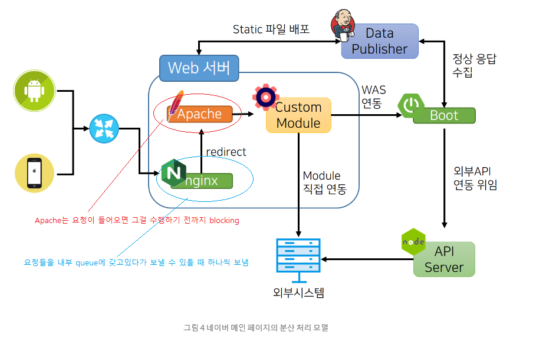
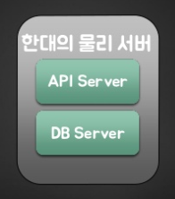
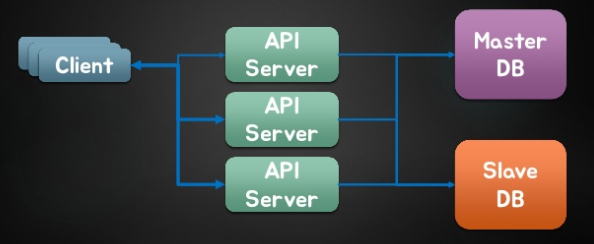
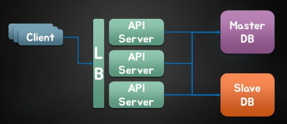
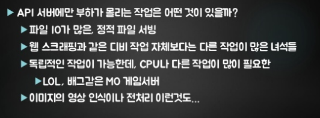
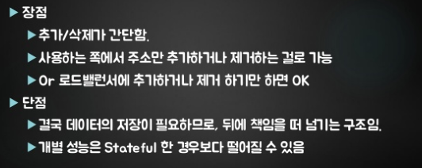

### 들어가기 전

> https://d2.naver.com/helloworld/6070967

---

---

<https://www.slideshare.net/charsyam2/webservice-scaling-for-newbie>

### 신규 입사자를 위한 웹서비스 확장 전략

#### 대규모 서비스의 특성

> **Elastic**
>
> - 트랙픽이나 상황에 따라 서버의 추가/제거가 쉬워야 함.

> **Resiliency**
>
> - 특정 장비의 장애 등은 자동으로 복구가 되어야 함
>   - 서버가 복구되는 것은 아님
>   - 해당 장비의 장애로 인해 다른 쪽이 영향 받지 않아야 함

---

스케일 업(Scale Up)

- 서버 기능 ↑

스케일 다운(Scale Down)

- 하드웨어 개수를 수평으로 ↑↑↑

---

SPOF (Single Point Of Failure)

- 시스템 구성 요소 중에서, 동작하지 않으면 전체 시스템이 중단되는 요소를 말한다.

  > 
  >
  > 

---

#### DNS - Name Service

---

#### LB(로드밸런서) - Name Service

VRRP - Keep alived

---

#### API 서버

> 

#### DB 서버

> 
>
> - DB는 lock을 최대한 짧게 거는 것이 좋음
>
> - dead lock? A가 데이터를 건들일 때 , B가 똑같은 작업을 수행하면 A의 작업이 안될수도
>
>   >  트랜지션!
>
> - join과 단일테이블은 별 차이가 없다
>
>   > 상황에 따라 다르게 적용해서 쓰면 됨
>   >
>   > join이 느릴거같다는 착각! -> 전체 탐색을 안하고 특정 조건을 입혀 탐색 횟수를 줄일 수 있음

---

#### Stateless

---

#### Slave 장비를 추가하면 계속 성능이 증가할까?

-> 한계가 있다 ! 너무 많이 추가하면 master가 너무 느려짐! 