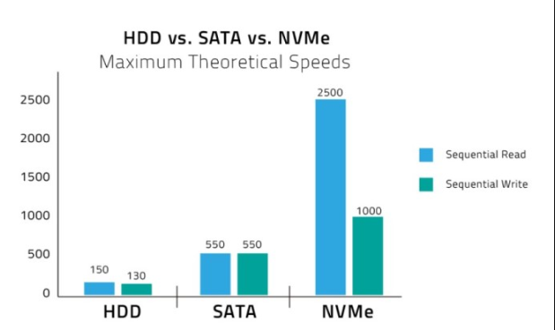

지난 수업 중요 단어 - 스케일 업, 스케일 아웃, 리플리케이션

캐시가 중요함, 캐시없는 대규모 서비스는 없다!!!

**NIC**

---

Sata와 SSD와 2배차이, SSD와 NVMe 2배차이

디스크나 외부호출 줄이기! 

cached -> disk로 가는걸 최대한 줄이고 성능 개선하는 것

[Memcached 위키](<https://aws.amazon.com/ko/memcached/>)

[Memcached D2](https://d2.naver.com/helloworld/151047)

Memchached 정의 및 사용법-> <https://jdm.kr/blog/137>

---

어플리케이션을 설계할 수 있는가 없는가

---

1 Apache 

2 App(WAS)

- Disk
- Memory

[서비스 순서]

Client에서 aaa.com을 실행하면 DNS를 먼저 갔다

client ->Nginx -> Apache -> App -> Disk or Memory

​		Http에서 캐싱 -> 리버스 프록시

[varnish](<https://d2.naver.com/helloworld/352076>) cache -> Http Header를 통안 브라우저 캐싱

cpu에서도 어떤 캐시냐에 따라 성능이 달라짐

---

cafe24api.com/board/1/get/list

바니쉬에서 board에 대한 요청을 캐시할수있고,

app레벨에서의 캐시를 할수도 있음 -> 판단은 개발자의 몫

캐시를 잘하기 위해선 기본적으로 모듈화를 잘해놔야함!

---

Storage

replica

shard

---

**Storage**

<https://www.redhat.com/ko/topics/data-storage/file-block-object-storage>

- file Storage ; 가장 느림
  - 기존 file 시스템과 호환
  - 동시 읽기, 쓰기 가능
  - \a\b\c\d\ .. 경로 접근

- block Storage 
  - file과 비슷하지만 동시 읽기, 쓰기는 불가능
  - RDBMS

- object Storage
  - data에 대한 경로를 직접 접근하게  - 단일경로 제공

