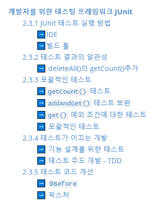

[TOC]

---



---

# 개발자를 위한 테스팅 프레임워크 JUnit


>  **테스트가 없다면 스프링 프레임워크도 의미가 없다**


---

## 2.3.1 JUnit 테스트 실행 방법

JUnitCore를 통해 테스트 실행 후 콘솔에 출력하는 것은 간단하긴 하지만

테스트 수가 많아 질수록 관리하기가 힘들다. 이를 위해 JUnit테스트 지원 도구를 사용하는 것

### :arrow_right:IDE

이클립스에서 JUnit테스트를 지원하는 기능을 제공함

`@Test`가 들어있는 테스트 클래스를 선택한 뒤, Run As에서 JUnit Test를 실행하면 된다.

> main()메소드를 만들지 않아도 실행 가능


> ​								JUnit 테스트 정보를 표시해주는 뷰[^view]가 테스트 진행 상태를 알려줌
>
> 총 수행시간, 실행한 테스트 수, 테스트 에러의 수, 테스트 실패의 수, 어떤 클래스를 실행했는지, 테스트 클래스 내에 있는 `@Test`가 붙은 메소드 이름, 각 수행에 걸린 시간 등을 확인할 수 있음


> ​											실패시 검증에 실패한 메소드와 정보를 확인할 수 있음

JUnit은 한번에 여러 테스트를 동시에 진행할 수 있다. 

Run As 메뉴의 JUnit Test를 실행하면, 해당 패키지 아래에 있는 모든 JUnit 테스트를 실행해준다.


### :arrow_right:빌드 툴

빌드:question: - 소프트웨어를 생성하고 테스트하고 검사하여 배포하기 위해 수행하는 행위의 집단

- 빌드툴에서 제공하는 JUnit 플러그인, 태스크를 통해 실행 가능


---

## 2.3.2 테스트 결과의 일관성

요약 : 지금까지 테스트를 할 때, 사용자의 정보를 넣는 `add()`메소드를 실행하고나서

또 테스트를 하고 싶을 때, 직접 DB에서 사용자를 지운 뒤 다시 `add()`메소드를 실행했었다.

> 이전 테스트를 실행했을 때 등록된 사용자 정보와 기본키가 중복된다면 에러가 발생

여기서 문제가 바로, 외부 상태에 따라 테스트가 실패할수도 성공할수도 있다는 것이다

--> 코드에 변경사항이 없다면 테스트는 항상 동일한 결과를 가져와야한다!!

### :arrow_right: deleteAll()의 getCount()추가

일관성 있는 테스트를 위해

- `deleteAll()` 메소드(해당 테이블의 모든 레코드 삭제)를 추가
- `getCount()` 메소드(해당 테이블의 레코드 개수 리턴)를 추가

위 두 메소드를 독립적으로 실행되는 테스트를 만들기에 애매하다.

:arrow_right:`addAndGet()` 테스트를 확장하자!

```java
@Test
public void addAndGet(){
    dao.deleteAll();
    assertThat(dao.getCount(), is(0));
    
    dao.add(user);
	assertThat(dao.getCount(), is(1));   
    
    User user2 = dao.get(user.getId());
    assertThat(user2.getName(), is(user.getName()));
    assertThat(user2.getPassword(), is(user.getPassword()));
}
```

> 테스트를 실행한 뒤 `deleteAll()`메소드를 넣으면 다음 테스트를 진행하기 전에 혹시 데이터가 남아있으면 오류가 일어날수있기에, 언제든 어떤상황에서 실행해도 테스트가 성공할 수 있도록 제일 앞에 넣어준다
>
> - **테스트하기 전에 테스트 실행에 문제가 되지 않는 상태를 만들어 주는 것이 좋다**
>
> user를 추가하고 난 뒤 `getCount()`메소드를 통해 확인하고, 정보가 잘 삽입됐는지 재확인한다.


---

## 2.3.3 포괄적인 테스트

> 테스트를 안만드는 것 보다, 문제가 있는 코드인데 테스트를 성공하게 만드는 것이 더 위험

- 테스트는 한번에 한 가지 검증 목적에만 충실한 것이 좋다.


테스트 메소드 조건

:star: `@Test`가 붙어있고 `public`접근자가 있으며 리턴 값이 `void`형이고 파라미터가 `없다`는 조건


### :arrow_right:`getCount()` 테스트 

```java
@Test
public void Count(){
    // [ user1, user2, user3 ]  객체 생성 코드
    dao.deleteAll();
    assertThat(dao.getCount(), is(0));
    
    dao.add(user1);
    assertThat(dao.getCount(), is(1));
    
    dao.add(user2);
    assertThat(dao.getCount(), is(2));
    
    dao.add(user3);
    assertThat(dao.getCount(), is(3));
}
```

> 테스트는 순서를 보장하지 않기에 독립적으로 항상 동일한 결과를 내도록 작성해야한다.


### :arrow_right:`addAndGet()` 테스트 보완

```java
@Test
public void addAndGet(){
    // [ user1, user2, user3 ]  객체 생성 코드
    
    dao.deleteAll();
    assertThat(dao.getCount(), is(0));
    
    dao.add(user1);
    dao.add(user2);
	assertThat(dao.getCount(), is(2));   
    
    User userget1 = dao.get(user1.getId());
    assertThat(userget1.getName(), is(user1.getName()));
    assertThat(userget1.getPassword(), is(user1.getPassword()));
    
    User userget2 = dao.get(user2.getId());
    assertThat(userget2.getName(), is(user2.getName()));
    assertThat(userget2.getPassword(), is(user2.getPassword()));
}
```

> 좀 더 확신할 수 있는 테스트 코드 완성


### :arrow_right:`get()` 예외 조건에 대한 테스트

> 만약 get 메소드에 전달된 id값에 해당하는 사용자 정보가 없다면
>
> **EmptyResultDataAccessException** 발생!
>
> 이때는 UserDao의 get()메소드에서 쿼리를 실행한 결과가 아무것도 없을 때 이 예외를 던지게
>
> `if (user==null) throw new EmptyResultDataAccessException(1);` 를 추가해준다


### :arrow_right: 포괄적인 테스트

개발자의 흔한 실수는 성공하는 테스트만 골라서 만드는 것

:star: 부정적인 케이스를 먼저 만드는 습관을 들이는 게 좋다


---

## 2.3.4 테스트가 이끄는 개발

> 테스트를 먼저 만들어 테스트가 실패하는 것을 보고 나서 UserDao에 손을 댔다.
>
> 이런 개발 방법은 실제로 존재하고 적극적으로 사용되고 있다.


### :arrow_right: 기능 설계를 위한 테스트

> 우리는 먼저 생각으로 추가하고 싶은 기능을 코드로 표현하려고 했기에, Test를 먼저 만든 뒤 코드를 수정할 수 있었다.

테스트 코드는 마치 하나의 기능 정의서 처럼 보임

> 기능 설계, 구현, 테스트 라는 일반적인 개발 흐름의 기능설계에 해당하는 부분을 테스트 코드가 일부분 담당하고 있다고 볼 수 있음


### :arrow_right: 테스트 주도 개발 - TDD

장점

- TDD는 아예 테스트를 먼저 만들고 성공하도록 하는 코드만 만드는 식으로 진행

- 코드에 대한 피드백을 매우 빠르게 받을 수 있다.
- 테스트 성공시 코드에 대한 확신을 가질 수 있다.
- 자연스럽게 단위 테스트를 만들어 빠르게 자동으로 실행할 수 있다.
- 코드를 만들어 테스트를 실행하는 그 사이의 간격이 매우 짧다
- 오류를 빨리 발견할 수 있다.


---

## 2.3.5 테스트 코드 개선

테스트 코드의 리팩토링

`@Test` 가 붙은 메소드 마다 Dao를 가져오는 중복이 일어난다. 반복적으로 등장하는 코드를 제거하자!


### :arrow_right: `@Before`

```java
private UserDao dao;

@Before
public void setUp(){
    ApplicationContext context = 
        new GenericXmlApplicationContext("applicationContext.xml");
    this.dao = context.getBean("userDao", UserDao.class);
}
```

> 오브젝트를 인스턴스 변수로 선언후, 
>
> - `@Before` 메소드를 테스트 메소드에서 직접 호출하지 않기 때문에 인스턴스 변수 사용해야함
>
> `@Test`메소드가 실행되기 전 `@Before`를 정희해 `setUp()`메소드를 실행


**JUnit 테스트 수행 방식**

1. `@Test`가 붙은 public void형 파라미터가 없는 메소드를 모두 찾는다
2. 테스트 클래스의 오브젝트를 하나 만든다
3. `@Before`가 붙은 메소드 실행
4. `@Test` 붙은 메소드 하나 호출 후 테스트 결과 저장
5. `@After` 가 붙은 메소드 실행
6. 2~5번 반복
7. 모든 테스트 결과 종합해서 돌려줌


:star:테스트 메소드를 실행할 때마다, 테스트 클래스의 오브젝트를 새로 만든다?

=> 각 테스트가 서로 영향을 주지 않고 독립적으로 실행됨을 확실하게 보장해주기 위해서!


### :arrow_right: 픽스처

테스트를 수행하는 데 필요한 정보나 오브젝트를 픽스처 라고 한다.

UserDaoTest에서 dao가 픽스처

add()메소드에 전달하는 User 오브젝트들도 픽스처!

이런 중복되는 부분들은 메소드를 하나로 빼고 

`@Before`로 오브젝트 생성하는 것이 좋다!


